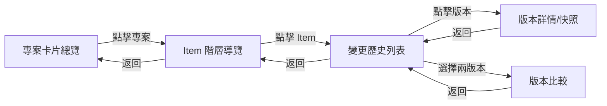

# Item 變更歷史功能規劃 (history_fun.md)

> 最後更新: 2025-12-31

---

## 1. 功能目標

建立完整的 Item 變更歷史追蹤系統，讓使用者可以：

1. **檢視歷史版本** - 查看 Item 的所有歷史變更紀錄
2. **追蹤變更者** - 記錄誰提交了變更請求
3. **追蹤審核者** - 記錄誰核准/拒絕了變更
4. **差異比較** - 比較任意兩個版本之間的差異
5. **版本還原** - (可選) 將 Item 還原至特定歷史版本

---

## 2. 資料模型設計

### 2.1 新增 ItemHistory 模型

```prisma
model ItemHistory {
  id          Int      @id @default(autoincrement())
  
  // 關聯到 Item
  itemId      Int
  item        Item     @relation(fields: [itemId], references: [id])
  
  // 版本號 (遞增)
  version     Int
  
  // 變更類型
  changeType  String   // "CREATE" | "UPDATE" | "DELETE" | "RESTORE"
  
  // 快照資料 (JSON)
  snapshot    String   // { title, content, attachments, relatedItems }
  
  // 變更差異 (JSON) - 僅 UPDATE 時有值
  diff        String?  // { title: { old, new }, content: { old, new }, ... }
  
  // 提交者
  submittedById String
  submittedBy   User   @relation("HistorySubmitter", fields: [submittedById], references: [id])
  
  // 審核者
  reviewedById  String?
  reviewedBy    User?  @relation("HistoryReviewer", fields: [reviewedById], references: [id])
  
  // 審核狀態
  reviewStatus  String // "APPROVED" | "REJECTED"
  reviewNote    String?
  
  // 關聯的 ChangeRequest
  changeRequestId Int?
  
  // 時間戳
  createdAt   DateTime @default(now())
  
  @@index([itemId, version])
  @@index([itemId, createdAt])
}
```

### 2.2 修改 Item 模型

```prisma
model Item {
  // ... existing fields ...
  
  // 新增: 當前版本號
  currentVersion Int @default(1)
  
  // 新增: 歷史紀錄關聯
  history ItemHistory[]
}
```

### 2.3 修改 User 模型

```prisma
model User {
  // ... existing relations ...
  
  // 新增: 歷史紀錄關聯
  submittedHistories ItemHistory[] @relation("HistorySubmitter")
  reviewedHistories  ItemHistory[] @relation("HistoryReviewer")
}
```

---

## 3. 核心功能設計

### 3.1 自動記錄歷史

當 ChangeRequest 被核准時，自動建立 ItemHistory 紀錄：

```typescript
// In approveRequest() - after applying changes
async function createHistoryRecord(
  item: Item,
  changeRequest: ChangeRequest,
  changeType: "CREATE" | "UPDATE" | "DELETE",
  oldData?: object
) {
  const snapshot = {
    title: item.title,
    content: item.content,
    attachments: item.attachments,
    relatedItems: item.relatedItems.map(ri => ({ id: ri.id, fullId: ri.fullId }))
  };
  
  const diff = changeType === "UPDATE" && oldData 
    ? computeDiff(oldData, snapshot) 
    : null;
  
  await prisma.itemHistory.create({
    data: {
      itemId: item.id,
      version: item.currentVersion + 1,
      changeType,
      snapshot: JSON.stringify(snapshot),
      diff: diff ? JSON.stringify(diff) : null,
      submittedById: changeRequest.submittedById,
      reviewedById: session.user.id,
      reviewStatus: "APPROVED",
      changeRequestId: changeRequest.id
    }
  });
  
  // 更新 Item 版本號
  await prisma.item.update({
    where: { id: item.id },
    data: { currentVersion: { increment: 1 } }
  });
}
```

### 3.2 差異計算函式

```typescript
function computeDiff(oldData: object, newData: object): object {
  const diff: Record<string, { old: any; new: any }> = {};
  
  for (const key of ['title', 'content', 'attachments', 'relatedItems']) {
    const oldVal = oldData[key];
    const newVal = newData[key];
    
    if (JSON.stringify(oldVal) !== JSON.stringify(newVal)) {
      diff[key] = { old: oldVal, new: newVal };
    }
  }
  
  return diff;
}
```

### 3.3 歷史查詢 API

```typescript
// Server Action: getItemHistory
export async function getItemHistory(itemId: number) {
  return await prisma.itemHistory.findMany({
    where: { itemId },
    include: {
      submittedBy: { select: { username: true } },
      reviewedBy: { select: { username: true } }
    },
    orderBy: { version: 'desc' }
  });
}

// Server Action: getHistoryDetail
export async function getHistoryDetail(historyId: number) {
  return await prisma.itemHistory.findUnique({
    where: { id: historyId },
    include: {
      submittedBy: { select: { username: true } },
      reviewedBy: { select: { username: true } },
      item: { select: { fullId: true, title: true } }
    }
  });
}

// Server Action: compareVersions
export async function compareVersions(itemId: number, versionA: number, versionB: number) {
  const [historyA, historyB] = await Promise.all([
    prisma.itemHistory.findFirst({ where: { itemId, version: versionA } }),
    prisma.itemHistory.findFirst({ where: { itemId, version: versionB } })
  ]);
  
  if (!historyA || !historyB) throw new Error("Version not found");
  
  return computeDiff(
    JSON.parse(historyA.snapshot),
    JSON.parse(historyB.snapshot)
  );
}
```

---

## 4. UI 設計

### 4.1 Item 詳情頁 - 變更歷史區塊

在 Item 詳情頁**最下方**直接顯示變更歷史列表（不需另開頁面）：

```
┌─────────────────────────────────────────────────────────┐
│  Item Content (Title, Content, Attachments, Related)    │
├─────────────────────────────────────────────────────────┤
│  📜 變更歷史                                             │
│  ──────────────────────────────────────────────────────  │
│  v3  │  2025-12-31 14:30  │  UPDATE  │  查看詳情 →      │
│  v2  │  2025-12-30 10:15  │  UPDATE  │  查看詳情 →      │
│  v1  │  2025-12-29 09:00  │  CREATE  │  查看詳情 →      │
└─────────────────────────────────────────────────────────┘
```

**顯示規則**：

- 位置：Item 詳情頁最下方（在 Attachments/Related Items 之後）
- 排序：**最新修改在最上方** (依 `createdAt DESC`)
- 欄位：版本號 (v1, v2...)、日期時間、變更類型
- 互動：點擊「查看詳情」連結至該版本的詳情頁

**範例程式碼**：

```tsx
// In /items/[id]/page.tsx
{item.history && item.history.length > 0 && (
  <div className="glass" style={{ padding: "2rem", marginTop: "2rem" }}>
    <h3>📜 變更歷史</h3>
    <table>
      <thead>
        <tr>
          <th>版本</th>
          <th>日期</th>
          <th>類型</th>
          <th>操作</th>
        </tr>
      </thead>
      <tbody>
        {item.history
          .sort((a, b) => b.createdAt - a.createdAt)
          .map(h => (
            <tr key={h.id}>
              <td>v{h.version}</td>
              <td>{formatDate(h.createdAt)}</td>
              <td>{h.changeType}</td>
              <td><Link href={`/items/${item.id}/history/${h.version}`}>查看詳情</Link></td>
            </tr>
          ))}
      </tbody>
    </table>
  </div>
)}
```

### 4.2 歷史詳情頁面 `/items/[id]/history/[version]`

| 欄位 | 說明 |
|------|------|
| 版本號 | v1, v2, v3... |
| 變更類型 | CREATE / UPDATE / DELETE |
| 變更者 | 提交變更的使用者 |
| 審核者 | 核准變更的使用者 |
| 時間 | 變更生效時間 |
| 快照內容 | Title, Content, Attachments, Related Items |
| 變更差異 | (UPDATE 時) 標示修改的欄位 |

### 4.3 版本比較頁面 `/items/[id]/history/compare`

- 下拉選單選擇兩個版本
- 並排顯示兩個版本的內容
- 差異部分以顏色標示 (新增: 綠色, 刪除: 紅色)

### 4.4 全域變更歷史頁面 (Dashboard 設計)

> **設計目的**：當 Item 被完全刪除後，仍可透過此頁面檢視過去的變更歷史
> **設計原則**：漸進式揭露 (Progressive Disclosure)，避免一次性顯示過多資訊

#### 第一層：專案卡片 `/admin/history`

每個 Project 顯示為一張卡片，點擊進入該專案的 Item 列表。

```text
┌─────────────────────────────────────────────────────────────────┐
│  📜 變更歷史總覽                                                 │
├─────────────────────────────────────────────────────────────────┤
│                                                                  │
│  ┌──────────────┐  ┌──────────────┐  ┌──────────────┐          │
│  │ 📁 Project A │  │ 📁 Project B │  │ 📁 Project C │          │
│  │              │  │              │  │              │          │
│  │ 12 Items     │  │ 8 Items      │  │ 5 Items      │          │
│  │ 45 變更紀錄  │  │ 23 變更紀錄  │  │ 12 變更紀錄  │          │
│  │              │  │              │  │              │          │
│  │ 最後變更:    │  │ 最後變更:    │  │ 最後變更:    │          │
│  │ 2025-12-31   │  │ 2025-12-30   │  │ 2025-12-28   │          │
│  └──────────────┘  └──────────────┘  └──────────────┘          │
│                                                                  │
└─────────────────────────────────────────────────────────────────┘
```

**卡片資訊**：

- 專案名稱
- Item 數量 (含已刪除)
- 變更紀錄總數
- 最後變更日期

---

#### 第二層：Item 階層導覽 `/admin/history/[projectId]`

點擊專案卡片後，顯示該專案的 Item 階層式樹狀結構（類似左側導覽選單）。

```text
┌─────────────────────────────────────────────────────────────────┐
│  📁 Project A > Item 列表                        [← 返回總覽]   │
├─────────────────────────────────────────────────────────────────┤
│                                                                  │
│  🔍 搜尋 Item: [________________]                               │
│                                                                  │
│  ┌─────────────────────────────────────────────────────────────┐│
│  │ ▼ WQ-1 需求規格書                              5 變更紀錄   ││
│  │   ├─ WQ-1-1 功能需求                           3 變更紀錄   ││
│  │   └─ WQ-1-2 非功能需求                         2 變更紀錄   ││
│  │                                                              ││
│  │ ▼ WQ-2 系統設計文件                            8 變更紀錄   ││
│  │   ├─ WQ-2-1 架構設計                           4 變更紀錄   ││
│  │   └─ WQ-2-2 資料庫設計                         2 變更紀錄   ││
│  │                                                              ││
│  │ ⚠️ WQ-3 (已刪除)                               3 變更紀錄   ││
│  └─────────────────────────────────────────────────────────────┘│
│                                                                  │
└─────────────────────────────────────────────────────────────────┘
```

**功能特色**：

- **階層式樹狀結構**：與左側導覽選單風格一致
- **摺疊/展開**：可展開或收合子項目
- **已刪除標記**：已刪除的 Item 以 ⚠️ 標示
- **變更紀錄數**：每個 Item 旁顯示變更紀錄數量
- **搜尋功能**：可依 Item 編號或標題搜尋

---

#### 第三層：變更歷史列表 `/admin/history/[projectId]/[itemFullId]`

點擊 Item 後，顯示該 Item 的完整變更歷史。

```text
┌─────────────────────────────────────────────────────────────────┐
│  📁 Project A > WQ-1 需求規格書 > 變更歷史       [← 返回列表]   │
├─────────────────────────────────────────────────────────────────┤
│                                                                  │
│  [篩選] Type: [All ▼]  Date: [____] ~ [____]                    │
│                                                                  │
│  ┌──────┬────────────┬────────┬──────────┬────────┬──────────┐ │
│  │ 版本 │ 日期       │ 類型   │ 提交者   │ 審核者 │ 操作     │ │
│  ├──────┼────────────┼────────┼──────────┼────────┼──────────┤ │
│  │ v5   │ 2025-12-31 │ UPDATE │ editor1  │ admin  │ 查看詳情 │ │
│  │ v4   │ 2025-12-30 │ UPDATE │ editor2  │ admin  │ 查看詳情 │ │
│  │ v3   │ 2025-12-28 │ UPDATE │ editor1  │ insp   │ 查看詳情 │ │
│  │ v2   │ 2025-12-25 │ UPDATE │ editor1  │ admin  │ 查看詳情 │ │
│  │ v1   │ 2025-12-20 │ CREATE │ admin    │ admin  │ 查看詳情 │ │
│  └──────┴────────────┴────────┴──────────┴────────┴──────────┘ │
│                                                                  │
│  [比較版本] v[__] vs v[__]  [比較]                              │
│                                                                  │
└─────────────────────────────────────────────────────────────────┘
```

**功能特色**：

- **最新在上**：依時間倒序排列
- **完整資訊**：版本號、日期、類型、提交者、審核者
- **查看詳情**：點擊可查看該版本的完整快照與差異
- **版本比較**：可選擇任意兩個版本進行比較
- **篩選功能**：可依變更類型、日期範圍篩選

---

#### 導覽流程圖



---

**資料模型調整**：

為確保 Item 刪除後歷史仍可查詢，`ItemHistory` 需額外儲存識別資訊：

```prisma
model ItemHistory {
  // ... existing fields ...
  
  // 新增: 冗餘儲存 Item 識別資訊 (防止 Item 刪除後無法識別)
  itemFullId    String    // e.g. "WQ-1"
  itemTitle     String    // 當時的標題
  projectId     Int       // 所屬專案 ID
  project       Project   @relation(fields: [projectId], references: [id])
  
  // 修改: itemId 改為可選 (Item 刪除後會變 null)
  itemId        Int?
  item          Item?     @relation(fields: [itemId], references: [id], onDelete: SetNull)
}
```

**API 設計**：

```typescript
// 第一層: 取得專案列表與統計
export async function getProjectHistoryStats() {
  return await prisma.project.findMany({
    include: {
      _count: { select: { items: true } },
      itemHistories: {
        select: { id: true, createdAt: true },
        orderBy: { createdAt: 'desc' },
        take: 1
      }
    }
  });
}

// 第二層: 取得專案下的 Item 列表 (含已刪除)
export async function getProjectItems(projectId: number) {
  // 從 ItemHistory 取得所有曾存在的 Item (含已刪除)
  const histories = await prisma.itemHistory.findMany({
    where: { projectId },
    select: { itemFullId: true, itemTitle: true, itemId: true },
    distinct: ['itemFullId']
  });
  
  // 計算每個 Item 的變更紀錄數
  // ...
}

// 第三層: 取得 Item 的變更歷史
export async function getItemHistoryByFullId(projectId: number, itemFullId: string) {
  return await prisma.itemHistory.findMany({
    where: { projectId, itemFullId },
    include: {
      submittedBy: { select: { username: true } },
      reviewedBy: { select: { username: true } }
    },
    orderBy: { createdAt: 'desc' }
  });
}
```

**權限控管**：

- 僅 Admin/Inspector 可存取此頁面
- 在 layout 或 middleware 進行權限檢查

---

## 5. 實作步驟

### Phase 1: 資料庫設計 (預估: 1.5 小時)

- [ ] 1.1 新增 `ItemHistory` 模型至 `schema.prisma`
- [ ] 1.2 新增冗餘欄位：`itemFullId`, `itemTitle`, `projectId`
- [ ] 1.3 設定 `itemId` 為可選欄位，並加上 `onDelete: SetNull`
- [ ] 1.4 修改 `Item` 模型，新增 `currentVersion` 欄位
- [ ] 1.5 修改 `User` 模型，新增關聯
- [ ] 1.6 修改 `Project` 模型，新增 `ItemHistory[]` 關聯
- [ ] 1.7 執行 `npx prisma migrate dev`
- [ ] 1.8 執行 `npx prisma generate`

### Phase 2: 後端邏輯 (預估: 2.5 小時)

- [ ] 2.1 建立 `src/actions/history.ts`
- [ ] 2.2 實作 `createHistoryRecord` 函式 (包含冗餘欄位)
- [ ] 2.3 實作 `computeDiff` 函式
- [ ] 2.4 修改 `approveRequest` 函式，整合歷史記錄
- [ ] 2.5 實作 `getItemHistory` Server Action
- [ ] 2.6 實作 `getHistoryDetail` Server Action
- [ ] 2.7 實作 `compareVersions` Server Action
- [ ] 2.8 實作 `getGlobalHistory` Server Action (支援篩選)

### Phase 3: 前端 UI (預估: 4 小時)

- [ ] 3.1 在 Item 詳情頁底部新增變更歷史區塊
- [ ] 3.2 建立 `/items/[id]/history/[version]/page.tsx` 版本詳情頁面
- [ ] 3.3 建立 `HistoryDetail` 元件
- [ ] 3.4 建立 `/items/[id]/history/compare/page.tsx` 版本比較頁面
- [ ] 3.5 建立 `VersionCompare` 元件
- [ ] 3.6 建立 `/admin/history/page.tsx` 全域變更歷史頁面
- [ ] 3.7 建立 `GlobalHistoryList` 元件 (支援專案分組與篩選)
- [ ] 3.8 在 Admin 選單新增「變更歷史」連結

### Phase 4: 驗證與測試 (預估: 1.5 小時)

- [ ] 4.1 測試 CREATE 後是否產生歷史紀錄
- [ ] 4.2 測試 UPDATE 後是否產生歷史紀錄與差異
- [ ] 4.3 測試歷史列表顯示是否正確
- [ ] 4.4 測試版本詳情顯示是否正確
- [ ] 4.5 測試版本比較功能是否正確
- [ ] 4.6 驗證權限控管 (登入使用者才可查看)
- [ ] 4.7 測試 Item 刪除後，全域歷史頁面是否仍可查看歷史紀錄
- [ ] 4.8 測試全域歷史頁面篩選功能

---

## 6. 注意事項

### 6.1 效能考量

- `snapshot` 欄位可能很大 (包含 Rich Text 內容)，考慮資料庫成長
- 歷史查詢加上分頁機制
- 考慮為 `itemId + version` 建立複合索引

### 6.2 安全性

- 歷史紀錄應為唯讀，不可修改或刪除
- 只有登入使用者可以查看歷史
- 考慮是否需要更嚴格的權限 (例如只有該專案成員可查看)

### 6.3 擴展性

- 未來可考慮加入「版本還原」功能
- 未來可考慮加入「變更通知」功能 (Email/訂閱)
- 未來可考慮 Project 層級的歷史追蹤

---

## 7. 預估工時

| 階段 | 工時 |
|------|------|
| Phase 1: 資料庫設計 | 1.5 小時 |
| Phase 2: 後端邏輯 | 2.5 小時 |
| Phase 3: 前端 UI | 4 小時 |
| Phase 4: 驗證與測試 | 1.5 小時 |
| **總計** | **9.5 小時** |

---

## 8. 相關檔案

| 檔案 | 說明 |
|------|------|
| `prisma/schema.prisma` | 資料庫 Schema |
| `src/actions/history.ts` | 歷史相關 Server Actions |
| `src/actions/approval.ts` | 修改以整合歷史記錄 |
| `src/app/items/[id]/history/` | 歷史相關頁面 |
| `src/components/history/` | 歷史相關元件 |
